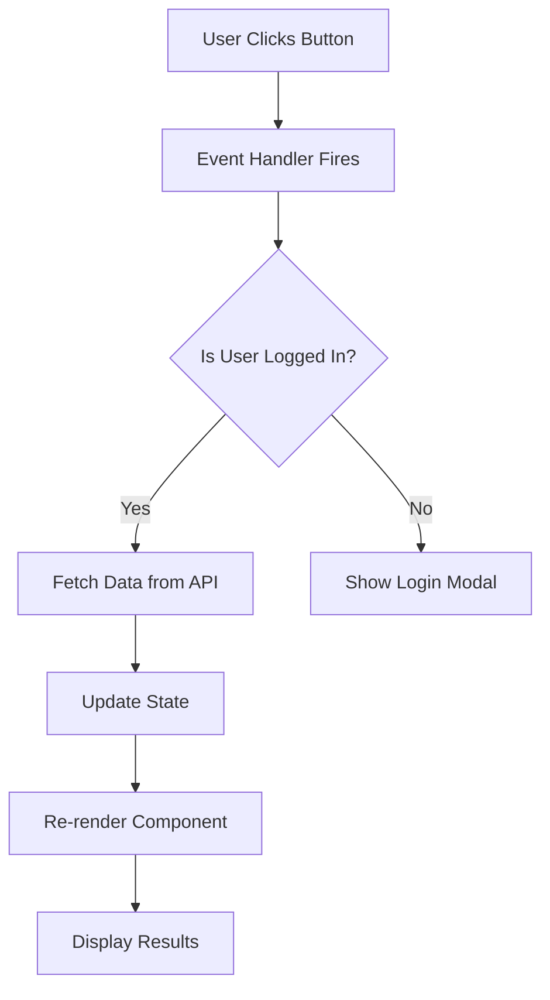

# Explained Code - Beginner-Friendly Code Explanation Skill

> Transforms complex code into intuitive, step-by-step explanations using analogies, diagrams, and plain language. Designed for beginners and non-developers.

*Version: 1.0 | Last Updated: April 2026*

---

## Context

This skill is for explaining code to people who are NOT experts. It breaks down complex code into digestible pieces using everyday analogies, visual diagrams, and progressive revelation.

Use this skill when:
- A beginner asks "what does this code do?"
- You need to explain a function, module, or system to a non-developer
- Writing documentation or onboarding materials for new developers
- Creating educational content (tutorials, blog posts, course materials)
- Reviewing code with stakeholders who don't write code

---

## Instructions

### Step 1: Start with an Analogy

Before showing ANY code, find a real-world analogy that captures the essence of what the code does. The analogy should:
- Use everyday objects, systems, or experiences
- Map 1:1 to the code's structure (parts of analogy = parts of code)
- Be accessible to someone with ZERO programming knowledge

**Example for a sorting algorithm:**
> "Imagine you have a messy stack of exam papers and you need to arrange them from lowest to highest score. You pick up two papers at a time, compare them, and put them in order. Repeat until the whole stack is sorted. That's what a bubble sort does."

### Step 2: Draw a Diagram

Create a visual representation using ASCII art or Mermaid diagrams. The diagram must show:
- **Data flow**: How data enters, transforms, and exits
- **Structure**: The shape of the code (functions, loops, conditionals)
- **Relationships**: How components connect to each other

**ASCII Art Example (API Request):**
```
[Your App] --request--> [Server]
                           |
                      [Database]
                           |
[Your App] <--response-- [Server]
```

**Mermaid Diagram Example (React Component):**


### Step 3: Walk Through the Code Step-by-Step

Explain the code in a linear narrative, section by section. For each section:

1. **State what this part does** in one plain sentence
2. **Show the code snippet** (5-15 lines max per section)
3. **Explain each line** in plain English
4. **Connect to the analogy** from Step 1

**Format:**

```markdown
### Step 1: [Plain English Title]
**What it does:** One sentence explanation.

\`\`\`javascript
// Show 5-15 lines of code here
\`\`\`

**Line by line:**
- Line 1: `code_here` -- this does X, like [analogy reference]
- Line 2: `code_here` -- this does Y, which is like [analogy reference]
- Line 3: `code_here` -- this checks Z before moving on
```

### Step 4: Highlight the "Gotcha"

After the walkthrough, call out the most common mistake, misconception, or subtle behavior that trips people up. Format:

```
WARNING (The Gotcha): [Explain the subtle issue]
Why it matters: [Explain the consequence]
How to avoid it: [Concrete solution]
```

**Example:**
```
WARNING (The Gotcha): JavaScript's `==` operator tries to convert types before comparing.
So `0 == "0"` returns true, even though one is a number and one is a string.
Why it matters: This causes bugs where you think you're checking for an empty string
but you're also matching the number zero.
How to avoid it: Always use `===` (strict equality) which checks both value AND type.
```

### Step 5: Provide a "Try It Yourself" Challenge

End with a small, achievable exercise that reinforces understanding:

```
YOUR TURN: [Simple challenge description]
Hint: [One hint to get started]
Expected output: [What the correct result looks like]
```

---

## Constraints

- NEVER explain code without first providing an analogy
- NEVER show more than 15 lines of code per step without breaking
- NEVER use jargon without defining it first in plain language
- NEVER skip the "Gotcha" step -- subtle behaviors are where beginners fail
- NEVER assume the reader knows any programming concepts not explained in the walkthrough
- NEVER produce a wall of text -- every explanation must have visual breaks (diagrams, code blocks, callouts)
- NEVER use technical terms as the primary explanation -- always lead with plain language

---

## Examples

### Example 1: Explaining a Simple API Call

#### The Analogy
> Think of an API call like ordering food at a restaurant. You (the app) look at the menu (the API documentation), tell the waiter what you want (the request), wait in the kitchen (the server processes it), and get your food delivered to your table (the response).

#### The Diagram
```
Your App          API Server           Database
   |                  |                    |
   |--GET /users----->|                    |
   |                  |--Query users------>|
   |                  |<-Return data-------|
   |<-JSON response---|                    |
   |                  |                    |
   [Display users]   [Send response]    [Store data]
```

#### The Walkthrough

**Step 1: Set up the request**
**What it does:** Tells the app WHERE to get data from.

```javascript
const url = "https://api.example.com/users";
```
- `const url` -- this is like writing down the restaurant's address on a napkin
- `"https://..."` -- the full web address of the data we want

**Step 2: Fetch the data**
**What it does:** Goes to the server and asks for the data.

```javascript
const response = await fetch(url);
const data = await response.json();
```
- `fetch(url)` -- this is like flagging down the waiter and placing your order
- `await` -- this means "wait here until the kitchen finishes cooking"
- `.json()` -- this translates the raw data from server language into JavaScript

#### The Gotcha
```
WARNING: `fetch()` doesn't throw an error when the server returns 404 or 500.
It only throws when the network itself fails (no Wi-Fi, server down).
You MUST check `response.ok` before using the data.
```

---

### Example 2: Explaining a React Component

#### The Analogy
> A React component is like a LEGO instruction page. It shows you how to assemble specific pieces (props) into a finished toy (the rendered UI). Every time you swap a piece, the toy rebuilds automatically.

#### Complete Output Structure

Every explanation MUST follow this template in order:
1. **Analogy** (real-world comparison)
2. **Diagram** (ASCII or Mermaid)
3. **Code Walkthrough** (step-by-step, 5-15 lines each)
4. **The Gotcha** (common pitfall)
5. **Your Turn** (practice challenge)

---

*Inspired by Anthropic's "Explained Code" official example and alexanderop/walkthrough (GitHub).*
